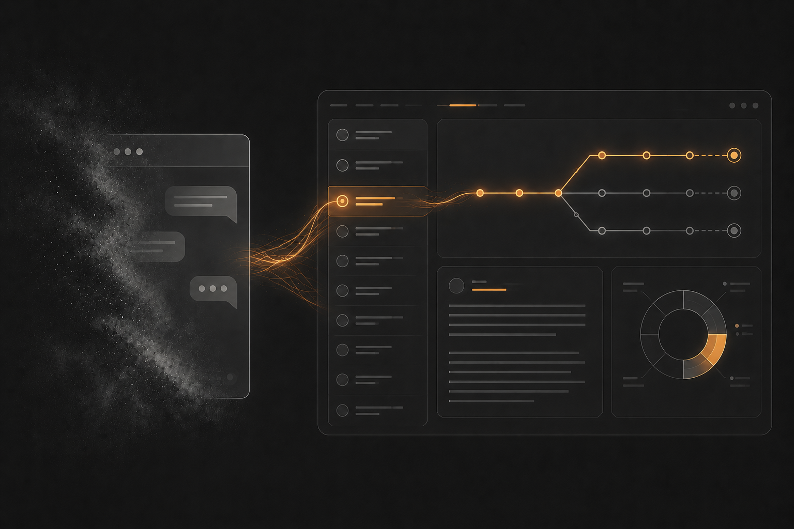

# Sessionless Workload Context

[Intent](/README.md) | [Getting Started](/docs/usage.md) | [User Guide](/docs/usage.md#using-the-workflows) | [Plugin Design](/docs/plugin-design.md)

 

**Claude forgets. Your project shouldn't.**

 
A Claude Code plugin for structured software delivery - Agents implement from a backlog, context is externalised from sessions, and your project keeps moving whether Claude remembers or not.

 

<em>Agentic delivery of items in your workload using workflows with saved domain knowledge</em>

## Intent

Sessionless Workload Context (SWC) is a suite of skills that embodies a delivery operating model to guide agents through the complete lifecycle - from capturing intent and breaking down work, through clarifying requirements and quality validations, to deliverying solutions.

SWC onboards an agent to best practice delivery culture — the same way you would onboard a skilled person to your team. It prescribes workflows, conventions, and feedback loops so you can act as product owner: breaking down work, steering agents through small focused workitems, and validating quality at each stage.

Taking a systems based orchestrated delivery approach to agentic onboarding we can support adoption by:
 - externalising culture with system workflows & conventions
 - externalising project domain context by externalising requirements, design & state

### Continuity thinking applied to agentic work

Good teams don't keep a project alive in one person's head — they externalise it with systems and documents. Its possible for a new developer to pick up a well-documented piece of work without a handoff call (this doesnt replace super valuable human conversations, but you get the idea). SWC applies that same thinking to AI sessions. A conversation with Claude is ephemeral; the work is not. By persisting intent, requirements, decisions, and progress into files that live alongside your code, SWC means the next session — whether it starts in five minutes, five days or five months — inherits the full context of what came before.

### SWC Benefits

- Scope adherence — agents work against a clear, bounded brief
- Continuity — pick up any session without context loss
- Documented project IP — decisions and rationale are captured, not lost TODO:(SPEC format)
- Quality — supported through BDD and user feedback loops
- Consistency — agent behaviour governed by documented conventions

**Requires:** the [`swc-workload-mcp`](https://github.com/ctracey/swc-workload-mcp) server to manage the workload tree (persisted to `.swc/<branch>/workload.json`). Registration is part of [Getting Started](/docs/usage.md#step-2-register-swc-workload-manager-mcp-server).

[Get Started](/docs/usage.md#getting-started)

 

---
[Intent](/README.md) | [Getting Started](/docs/usage.md#getting-started) | [User Guide](/docs/usage.md#using-the-workflows) | [Plugin Design](/docs/plugin-design.md)
