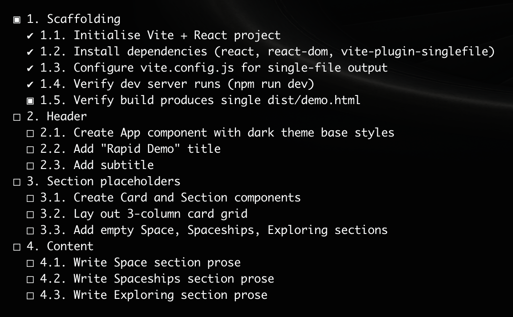
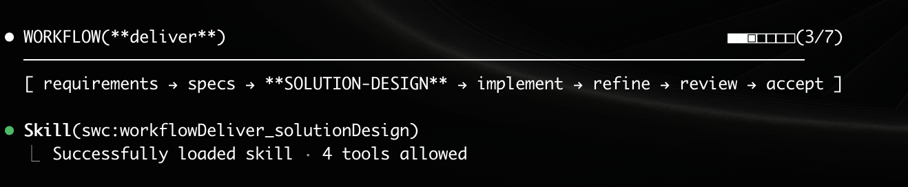

# Sessionless Workload Context

[Intent](/README.md) | [Getting Started](/docs/usage.md) | [User Guide](/docs/usage.md#using-the-workflows) | [Plugin Design](/docs/plugin-design.md)


## Plugin Design

SWC is structured following the [RKSS pattern](https://github.com/ctracey/rkss_pattern) — a recipe and knowledge skill separation pattern. Claude's extensible mechanisms (skills, agents, hooks) are organised into recipes, orchestration, actions, and knowledge, keeping concerns cleanly separated and the plugin composable.

Since SWC is packaged as a plugin, it can be applied where relevant using the project scope.
SWC may be overkill for smaller, less complex projects. See [Usage](/docs/usage.md) for installation instructions.

- [Workload](#workload-mcp-server-swc-workload-mcp)
- [Persisted Context Artefacts](#persisted-context-artefacts)
- [Workflow Orchestrator](#workflow-orchestrator)
- [Skill Naming Convention](#skill-naming-convention)


## Workload (MCP Server: swc-workload-mcp)

Project workitems are stored in a workload backlog. This backlog can be created on command or via the plan workflow.

The workload artefact (`.swc/<branch>/workload.json`) is maintained by delegating to the [`swc-workload-mcp`](https://github.com/ctracey/swc-workload-mcp) server — never edited by hand.

Delegating to the MCP keeps workload mutations fast and token-efficient: scoped tool calls return only the structured data needed, avoiding repeated full-file reads and rewrites of `workload.json` by the model.

<a href="./img/screenshot_sample-workload.png"></a><br/>
<em>screenshot: sample workload report for a react project</em>

 - Skills are used to manage this workload.
 - Workitem status are updated as they progress through deliver workflow.
 - Works well when workitems are numbered.
 - Context is stored per work item


## Persisted Context Artefacts

Context documents are persisted to `.swc/` and can be included in your git repo.

 - Documents are stored in subfolder for their specific branch. (Ref:  [swc:context-lookup skill](/skills/context-lookup/SKILL.md) )
 - Files are stubbed per branch as required. (Ref:  [swc:context-init skill](/skills/context-init/SKILL.md) )

```
.swc/
├── _meta.json                  # branch → folder mapping
└── <branch>/                   # one folder per branch
    ├── workload.json           # backlog of work items — owned by the swc-workload MCP (never edit by hand)
    ├── plan.md                 # intent, approach, open questions
    ├── architecture.md         # technical design
    ├── pipeline.md             # delivery pipeline
    ├── notes.md                # decisions and observations
    ├── changelog.md            # what changed and when
    └── workitems/
        └── <N>/                # one folder per work item
            ├── requirements.md # intent, constraints, approach
            ├── specs.md        # acceptance scenarios (BDD)
            ├── solution.md     # implementation design
            ├── context.md      # running agent log (one entry per pass)
            └── summary.md      # implementation summary per pass (changes, testing, pipeline, confidence)
```


## Workflow Orchestrator

The workflow orchestrator manages progression through defined stages, each implemented as a discrete skill. Stages are executed sequentially, with the orchestrator evaluating exit criteria specified by each skill before proceeding to the next phase.

<a href="./img/screenshot_workflowDeliver.png"></a><br/>
<em>screenshot: workflow progress</em>

The Workflow Orchestrator ensures:
- Each stage skill defines its own exit criteria and success conditions
- Exit criteria are enforced as policy, ensuring work meets defined standards before progression. (Ref: [swc:workflow-orchestrator skill](/skills/workflow-orchestrator/SKILL.md) )
- Workflow progress is visualised at each stage, providing clear visibility into current state and completion status. (Ref: [swc:workflow-progress skill](/skills/workflow-progress/SKILL.md) )


## Skill Naming Convention

Skill names are structured identifiers that encode the object model using separators with distinct meanings:

(Ref:  [swc:skill--naming](/skills/skill--naming/SKILL.md) skill for the full convention. )

| Separator | Purpose |
|-----------|---------|
| `_` | Sub-objects |
| `-` | Actions |
| `--` | Knowledge |
| `camelCase` | Typed objects |

Example:
```
skils/
├── parent/
├── parent--wisdom/
├── parent_child/
├── parent_child-action/
├── parent_childPlayful
└── parent_childPlayful-action/
```