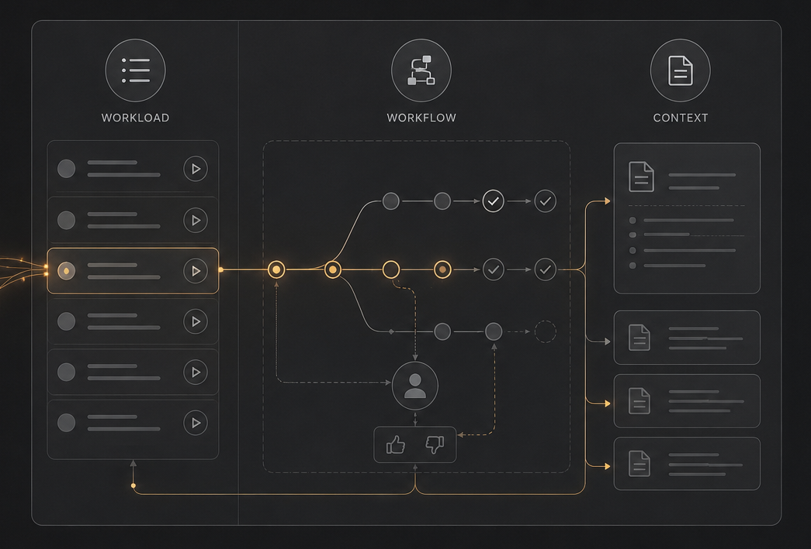

# Sessionless Workload Context

[Intent](/README.md) | [Getting Started](/docs/usage.md) | [User Guide](/docs/usage.md#using-the-workflows) | [Plugin Design](/docs/plugin-design.md)

- [Setup](#setup)
- [Start using SWC](#start-using-swc)
- [Using the Workflows](#using-the-workflows)
  - [Plan Workflow](#plan-workflow)
  - [Deliver Workflow](#deliver-workflow)
  - [Implement Workflow](#implement-workflow)

## Setup

### 1. Pre-requisites

NOTE: you can probably get claude code to install python when its first needed by the SWC workflow reports.

### 2. Plugin Manager

Currently this plugin is not published on a public claude code plugin marketplace, so you will need to host your own.
You can use something like [ctracey/claude-code-plugin-marketplace](https://github.com/ctracey/claude-code-plugin-marketplace) to setup a private local plugin marketplace.
Make sure you register your marketplace with your claude code config (follow your marketplace guide)

Check claude recognises your marketplace:

`claude plugins marketplace list`

### 3. Add this SWC Plugin to your marketplace

Once you have your claude code marketplace setup you can install this plugin.
Follow your marketplace guide. Should be something like this

 - Clone this repo to `~/claude-plugins/plugins/swc`
 - Add this plugin to the marketplace
 - Check marketplace recognises the plugin

### 4. Install this plugin

Once this plugin is available via a marketplace you can install it. Recommend installed with project scope

 - navigate to your project
 - run `claude plugin install swc@<MARKETPLACE_NAME> --scope project`

You should now be setup to use the SWC plugin.

## Start using SWC

SWC skills are prefixed with the swc namespace.

- navigate to your project folder
- start claude code `claude`
- you should be able to see SWC skills in the skills list. Prompt: `/swc:`

Try start a workflow. Prompt: `lets start a new project`

This will setup a `.swc/` folder with context based on your conversation that can be included in your git repo. Check [Plugin Design](/docs/plugin-design.md) to learn more.

### Prompts to try
 - `list workitems`
 - `add workitem to test out swc`
 - `mark work item n as done/in-progress`
 - `lets work on item n`
 - `whats the plan`

### Alternatively you can run the skill directly
  - `/swc:workload`
  - `/swc:workflowPlan`
  - `/swc:workflowDeliver n`
  - `/swc:report`

## Using the Workflows

The SWC plugin uses skills to guide an agent through the complete delivery lifecycle in collaboration with the user — from capturing intent and breaking down work, through clarifying requirements and solution design, to implementing and reviewing the solution — with persisted context at every step.

In your claude code session you can see the list of skills with: `/swc:`

<em>3 key SWC pillars: workload, workflows, context</em>

### SWC Workflows

3 main workflows guide the delivery lifecycle:

| Workflow | Description |
|----------|-------------|
| [**Plan**](/docs/usage.md#plan-workflow) | A structured conversation that captures intent, solution direction, delivery shape, and work breakdown, producing a set of planning docs any future session can execute from cold. |
| [**Deliver**](/docs/usage.md#deliver-workflow) | Drives a single work item from backlog to done: clarifying requirements, defining acceptance specs, solution design, implementation, code review, and user sign-off. |
| [**Implement**](/docs/usage.md#implement-workflow) | An agent-side workflow that orients against the brief, implements the solution scenario by scenario, and writes a summary artefact on completion. |

NOTE: these workflows are seen as a guide. If required the user can shortcut a process when overkill for a simple task.

## Plan Workflow

A structured conversation that captures intent, solution direction, delivery shape, and work breakdown, producing a set of planning docs any future session can execute from cold.

| Use Case ||
|--------------|-------------|
| **Scenario** | You are about to start a big piece of work |
| **Input** | The intent, approach, high-level design |
| **Output** | Documented notes, architecture & broken down workitems for delivery workload (saved: `.swc/`) |
| **Trigger** | PROMPT: `Lets start a new project` |

## Deliver Workflow

Drives a single work item from backlog to done: clarifying requirements, defining acceptance specs, solution design, implementation, code review, and user sign-off.
This workflow delegates to Implement Workflow when enough detail confirmed for implementation, then orchestrated feedback loops to review output.

| Use Case ||
|----------|-------------|
| **Scenario** | You are ready to start work on a workitem from your workload |
| **Input** | Detailed requirements, test scenarios, solution design preferences, review input |
| **Output** | Docs updated. Working solution with relevant tests as agreed. Workitem status maintained. |
| **Trigger** | PROMPT: `Lets start working on work item n` |

## Implement Workflow

An agent-side workflow that orients against the brief, implements the solution scenario by scenario, and writes a summary artefact on completion.
This Workflow should play nicely with other skills supporting good software dev practices. You might use different options based on different tech stacks.

| Use Case ||
|----------|-------------|
| **Scenario** | Enough context exists for an agent to implement a solution. |
| **Input** | SWC context documents for a specific workitem. |
| **Output** | Working solution including tests as agreed. Documents summarising changes. |
| **Trigger** | N/A - Used by agent spawned by Deliver Workflow Implement stage |
| **Alternative Trigger** | PROMPT: `/swc:workflowImplement n` |
